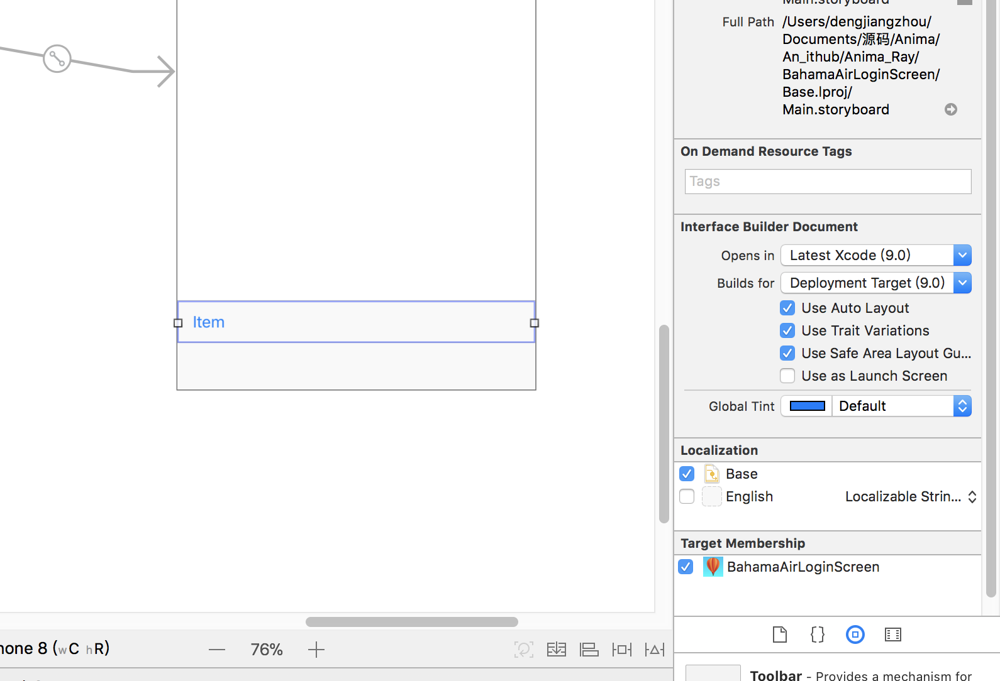

# Anima_Ray
Anima_Ray

 </img>

### Tips

#### 我没找到

>  Note: Some of your animations seem to run really quickly, don’t they? Sometimes it’s tricky to ensure the animation happens at just the right location, and in the correct sequence. Or maybe you just want things to happen slower so you can appreciate the effect!
> To slow down all animations in your app without changing your code, select Debug/Toggle Slow Animations in Frontmost App from the iPhone Simulator menu. Now tap the Login button in your app and enjoy the animations and transitions in vivid slow motion!

#### 我找到了

Simulator > Debug > Slow Animations.

### git 操作

<ul>
<li>
git push git@dengV:dengV/Anima_Ray.git
</li>

</ul>
